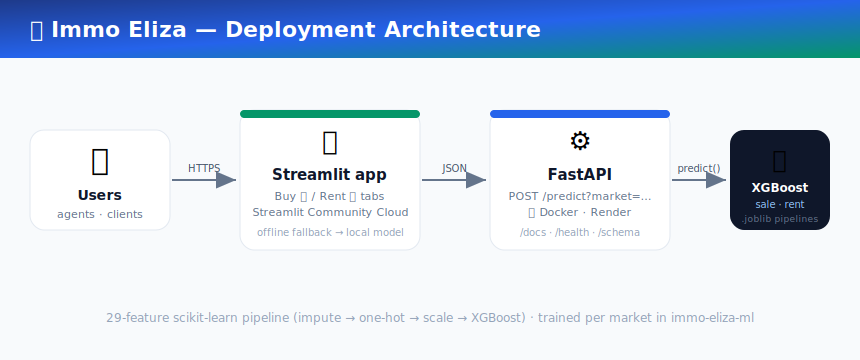

# 🏡 Immo Eliza — Property Price Prediction · Deployment

**Live estimates of Belgian real-estate prices — for both _buying_ and _renting_ — served by a FastAPI + Docker backend and a Streamlit web app.**

> ### 🚀 [**Try the live app →**](https://immo-eliza-deployment-trtrvzpqjymmxhf9bzuhbu.streamlit.app/)
> The Streamlit web app is deployed on **Streamlit Community Cloud**:
> <https://immo-eliza-deployment-trtrvzpqjymmxhf9bzuhbu.streamlit.app/>

This repository is the *deployment* half of the Immo Eliza project. It takes the
best model from the [machine-learning phase](#-the-model) — a **tuned XGBoost**
regressor — and puts it behind:

1. a **FastAPI** REST API (containerised with Docker, deployable to **Render**), and
2. a **Streamlit** web app with **Buy** and **Rent** tabs (deployable to **Streamlit Community Cloud**).

Both markets — **sale price** and **monthly rent** — are predicted by dedicated models that share the exact same **30-feature** preprocessing pipeline (now including a **neighbourhood-priciness** feature derived from the exact address).

<p align="center">
  
</p>

### ✨ New in v2 — neighbourhood-aware pricing

| | |
|---|---|
| 📍 **Exact-address pricing** | Address autocomplete (**Geopunt** for Flanders/Brussels, **OSM Photon** nationwide) resolves a street + house number to coordinates; an adaptive **priciness surface** (street/block → postcode → municipality) turns that into a model feature, so pricing pinpoints the address, not just the province. |
| 🗺️ **Priciness heatmap** | A map heatmap of €/m² (sale & rent) with a **red pin** for your property and **blue pins** for comparables. |
| 🔎 **Explainable** | A **SHAP** barchart shows how each entered feature pushed the price up/down (in €). |
| 🏘️ **Comparables** | Five real nearby listings at similar prices, to support the estimate. |
| ♻️ **Type once, price both** | A single shared input form above the tabs — switch **Buy ↔ Rent** and your inputs stay; the same property flows into **Invest**. |
| 📈 **Invest tab** | ROI from **rent alone** and **rent + projected capital appreciation** (Statbel history + ING/KBC scenarios), with break-even timing and returns at 5 / 10 / 15 / 20 years. |
| 🕸️ **Data pipeline** | A polite, resumable multi-site scraping **framework** (`scraper/`) + a documented cron path toward 100k+ sale / 30k+ rent deduplicated listings. |

New API routes: `POST /explain`, `POST /similar`, `GET /priciness` (+ `/priciness/tiles`), `GET /geocode/suggest`, `POST /geocode/resolve`, `POST /invest`. Spatial honesty check via `make eda` (grouped-by-location CV).

---

## ✨ Highlights

| | |
|---|---|
| 🏠🔑 **Two markets, shared inputs** | Predict **sale prices** *and* **monthly rents** for the same property — describe it once, switch tabs, both stay filled. |
| 🧠 **Best model shipped** | Tuned **XGBoost** over a 30-feature pipeline, trained on an enlarged de-duplicated store (**~24k sale / ~11.7k rent**: seed + scraped Immovlan/Immoweb). Sale **R² 0.79 · MAE €76k**, Rent **R² 0.74 · MAE €203/mo** (typical error lower than the small-data model on both; honest spatial-CV R² **0.76 / 0.68** on unseen neighbourhoods). |
| ⚡ **Self-contained pipeline** | Each artifact is a full scikit-learn `Pipeline` — pricing a home is one `pipeline.predict()` call, preprocessing included. |
| 🔌 **Clean REST API** | `GET /` liveness, `POST /predict`, `POST /predict/batch`, plus `/schema`, `/metrics`, `/health` — with auto-generated Swagger docs. |
| 🖥️ **Polished web app** | Gradient hero, live confidence bands, model-quality chips, a location map, and a model leaderboard. |
| 📏 **Honest confidence band** | Every estimate ships with a ± range derived from the model's held-out MAE. |
| 🛟 **Offline fallback** | The Streamlit app calls the API when available and *falls back to the bundled model* otherwise — it always works. |
| 🐳 **Production-ready Docker** | Slim `python:3.13-slim` image (< 700 MB), OpenMP runtime for XGBoost, container `HEALTHCHECK`, `$PORT`-aware. |
| ✅ **Tested & CI'd** | `pytest` suite for the engine *and* the API + a GitHub Actions pipeline that builds and smoke-tests the container. |

---

## 📁 Repository structure

```
imme-eliza-deployment/
├── api/                          # ── FastAPI backend (the deployable API) ──
│   ├── app.py                    #    FastAPI app: /, /predict, /predict/batch, /schema, /metrics, /health
│   ├── predict.py                #    predict() engine — loads models, preprocesses, scores (not a CLI)
│   ├── features.py               #    single source of truth: the 30-feature contract + options/ranges/geo
│   ├── explain.py                #    SHAP feature-contribution engine (/explain)
│   ├── similar.py                #    comparables engine — 5 nearby listings (/similar)
│   ├── models/                   #    shipped artifacts (tuned XGBoost, sale & rent — ~2–3 MB each)
│   │   ├── pricing_xgboost_sale.joblib
│   │   └── pricing_xgboost_rent.joblib
│   ├── Dockerfile                #    production image (built from the repo root — see render.yaml)
│   ├── requirements.txt          #    API runtime deps
│   └── .dockerignore
├── geo/                          # ── geocoding + neighbourhood priciness ──
│   ├── geocode.py                #    Geopunt + Photon address autocomplete/resolve
│   ├── priciness.py              #    adaptive H3/KNN priciness surface (sale & rent)
│   ├── build_reference.py        #    distil nis_postal.csv → centroids + municipality polygons
│   └── artifacts/                #    priciness_{sale,rent}.joblib
├── invest/                       # ── ROI engine ──
│   └── roi.py                    #    rental yield + capital appreciation → ROI/break-even (/invest)
├── scraper/                      # ── multi-site collection framework ──
│   ├── base.py, sites/           #    polite async adapters (immoweb, realo) + registry
│   ├── normalize.py, dedup.py    #    canonical schema, cross-site de-duplication
│   ├── store.py, run.py, seed.py #    resumable parquet store + CLI + seed from cleaned data
│   └── README.md                 #    add-an-adapter guide, legal/ToS note, cron scale-up
├── streamlit/                    # ── Streamlit frontend ──
│   ├── app.py                    #    shared inputs + Buy/Rent/Invest tabs, autocomplete, SHAP, heatmap
│   └── requirements.txt          #    Streamlit Cloud deps
├── ml/                           # ── FULL archive of last week's training project ──
│   ├── data/{in,training,test,dummy}/   raw + cleaned + split + dummy CSVs
│   ├── models/{0_empty,1_trained,2_tuned}/  all 8 models per stage + evaluation_results.csv
│   ├── src/                      #    preprocessing / create / train / tune / evaluate / predict
│   └── README.md                 #    the ML project's own write-up
├── data/
│   ├── listings/                 #    canonical listings parquet (sale/rent) — priciness + comparables
│   ├── geo/                      #    municipality centroids + simplified polygons (heatmap)
│   ├── invest/                   #    Statbel historical + projected prices + NIS↔postal crosswalk
│   ├── dummy/                    #    10 sale + 10 rent example listings (seed the UI/tests)
│   └── reference/                #    evaluation_results.csv (metrics table used by the app & docs)
├── tests/                        #    pytest: test_predict.py, test_api.py, test_neighbourhood.py
├── scripts/smoke_test_api.py     #    fire realistic requests at a running API
├── docs/                         #    architecture diagram + API usage notes
├── .github/workflows/ci.yml      #    test → build image → smoke-test container
├── render.yaml                   #    Render blueprint (one-click deploy)
├── Makefile                      #    make api / streamlit / test / docker-build …
├── requirements.txt              #    full dev/runtime deps (API + Streamlit + tests)
└── README.md                     #    ← you are here
```

---

## 🚀 Quick start (local)

**Prerequisites:** Python 3.13. On macOS, XGBoost needs the OpenMP runtime:
`brew install libomp`.

```bash
# 1. Set up the environment
make install               # creates .venv and installs requirements.txt
#   …or manually:
python3.13 -m venv .venv && source .venv/bin/activate && pip install -r requirements.txt

# 2a. Run the API  → http://localhost:8010  (interactive docs at /docs)
make api

# 2b. In another terminal, run the web app → http://localhost:8501
make streamlit

# 3. Smoke-test the API
make smoke                 # or: python scripts/smoke_test_api.py

# 4. Run the tests
make test
```

Point the Streamlit app at your API by setting `IMMO_API_URL`
(e.g. `export IMMO_API_URL=http://localhost:8010`) or by pasting the URL into
the app's sidebar. With no URL, the app runs fully offline on the bundled model.

---

## 🧠 The model

The deployed model is the **tuned XGBoost** regressor selected in the
[`immo-eliza-ml`](ml/README.md) project (a full copy of which lives in
[`ml/`](ml/)). It was the strongest of four algorithm families benchmarked on a
held-out test set:

### 🏠 Sale — sale price (€)
| Model | Test R² | MAE | RMSE |
|---|:---:|---:|---:|
| **XGBoost** ⭐ | **0.812** | €81,840 | €184,419 |
| Random Forest | 0.772 | €90,111 | €203,203 |
| Decision Tree | 0.707 | €116,293 | €230,361 |
| Linear *(baseline)* | 0.642 | €139,201 | €254,549 |

### 🔑 Rent — monthly rent (€)
| Model | Test R² | MAE | RMSE |
|---|:---:|---:|---:|
| **XGBoost** ⭐ | **0.627** | €254 | €659 |
| Random Forest | 0.586 | €269 | €694 |
| Decision Tree | 0.518 | €334 | €749 |
| Linear *(baseline)* | 0.532 | €353 | €738 |

> Numbers are **honest and leakage-free** (percentile outlier-trim on the
> *training* split only). Excluding the sparse ultra-luxury tail, tuned XGBoost
> reaches **R² ≈ 0.86 (sale)** and **≈ 0.83 (rent)** — it prices the bulk of the
> market very well. See [`ml/README.md`](ml/README.md) for the full story.

### Why deploy XGBoost and not the Random Forest?
Both perform similarly, but the tuned **Random Forest is ~35 MB** per market
while **XGBoost is ~2–3 MB** — an order of magnitude smaller, faster to load in a
container, and comfortably inside limits for free-tier hosting. XGBoost is also
marginally *more* accurate here. Best accuracy **and** the smallest footprint.

---

## 🔌 API reference

Base URL: `http://localhost:8010` (local) or your Render URL. Interactive docs:
`/docs` (Swagger) and `/redoc`.

| Method | Route | Purpose |
|---|---|---|
| `GET`  | `/` | Liveness probe — returns `"alive"`. |
| `GET`  | `/health` | Uptime, models loaded, library versions. |
| `GET`  | `/schema` | Full input contract (categories, ranges, defaults, geo) — build a form from one call. |
| `GET`  | `/metrics` | Held-out test metrics of the shipped models. |
| `POST` | `/predict?market=sale\|rent` | Price a **single** property. |
| `POST` | `/predict/batch` | Price **many** properties at once. |

### Input

Every feature is optional and defaulted — in practice `livable_surface`,
`property_type` and `province` are enough. Region and coordinates are
auto-derived from the province.

```jsonc
// POST /predict?market=sale
{
  "livable_surface": 85,
  "bedrooms": 2,
  "bathrooms": 1,
  "property_type": "flat",          // house | flat | villa | penthouse | …
  "province": "Brussels",           // one of the 11 Belgian provinces
  "epc": "C",                       // A++ … G
  "building_state": "Normal",
  "kitchen_equipment": "Fully equipped",
  "heating_type": "Gas",
  "terrace": true, "elevator": true, "has_parking": true
}
```

### Output

```jsonc
{
  "prediction": 341200.0,           // EUR (total for sale, per-month for rent)
  "market": "sale",
  "currency": "EUR",
  "unit": "total",                  // "per month" for rent
  "interval": { "low": 259360.0, "high": 423040.0 },   // ± the model's MAE
  "model": "XGBoost (tuned)",
  "metrics": { "r2": 0.8123, "mae": 81840.0, "rmse": 184419.0 },
  "status_code": 200
}
```

### `curl` examples

```bash
# Liveness
curl http://localhost:8010/

# Predict a sale price
curl -X POST "http://localhost:8010/predict?market=sale" \
  -H "Content-Type: application/json" \
  -d '{"livable_surface":85,"bedrooms":2,"property_type":"flat","province":"Brussels","epc":"C"}'

# Predict a monthly rent
curl -X POST "http://localhost:8010/predict?market=rent" \
  -H "Content-Type: application/json" \
  -d '{"livable_surface":90,"bedrooms":2,"property_type":"flat","province":"Antwerp"}'
```

Errors follow standard HTTP semantics: **422** for an invalid market/empty batch,
**503** if a model artifact is missing, **500** for an unexpected model error.

---

## 🐳 Docker

```bash
# Build (context = api/)
docker build -t immo-eliza-api ./api

# Run → http://localhost:8010  (host 8010 → container 8000)
docker run --rm -p 8010:8000 immo-eliza-api

# …or via Make
make docker-build && make docker-run
```

The image is based on `python:3.13-slim`, installs `libgomp1` (OpenMP, required
by XGBoost) and `curl` (for the `HEALTHCHECK`), pins deps to the training
versions, and honours Render's `$PORT`.

---

## ☁️ Deployment

### Backend → Render (Docker)

1. Push this repo to GitHub.
2. In Render: **New + → Blueprint**, point it at the repo. The included
   [`render.yaml`](render.yaml) provisions a Docker web service that builds
   `api/Dockerfile`, health-checks `/`, and auto-deploys on push.
   *(Or **New + → Web Service → Docker**, root `api/`, and let it read the Dockerfile.)*
3. When live, verify: `python scripts/smoke_test_api.py https://<your-app>.onrender.com`.

> Free-tier Render services sleep after inactivity; the first request after a
> nap takes a few seconds to wake. The Streamlit app handles this gracefully.

### Frontend → Streamlit Community Cloud

1. In Streamlit Community Cloud: **New app** → this repo → main file
   `streamlit/app.py`.
2. Add the API URL as an environment variable / secret `IMMO_API_URL`
   (your Render URL). Leave it unset to run on the bundled model.
3. Deploy. Streamlit picks up [`streamlit/requirements.txt`](streamlit/requirements.txt).

> **✅ Live:** this app is deployed at
> <https://immo-eliza-deployment-trtrvzpqjymmxhf9bzuhbu.streamlit.app/>

---

## 🧪 Testing & CI

```bash
make test          # pytest: engine (test_predict.py) + API (test_api.py)
```

The tests assert positive prices, that sale ≫ rent for the same home, that a
bigger house costs more, that the confidence band brackets the estimate, that
batch == single, and that the API's routes behave. The
[GitHub Actions pipeline](.github/workflows/ci.yml) runs the suite, then builds
the Docker image and smoke-tests the live container.

---

## 🗂️ Last week's ML project

The complete training project is archived under [`ml/`](ml/) — raw/cleaned/split
data, all 8 models across 3 stages (empty / trained / tuned), the full
`src/` pipeline (`preprocessing → create → train → tune → evaluate → predict`),
the evaluation table, and its own README. The deployment only *ships* the two
tuned-XGBoost artifacts (in `api/models/`), but everything needed to reproduce or
retrain them is here.

---

## ⚠️ Disclaimer

This is an educational project. Predictions are **statistical model estimates,
not professional valuations**. The model over-prices very small studios and
under-prices the ultra-luxury tail (both sparse in the training data).

---

## 📜 License

[MIT](LICENSE).
